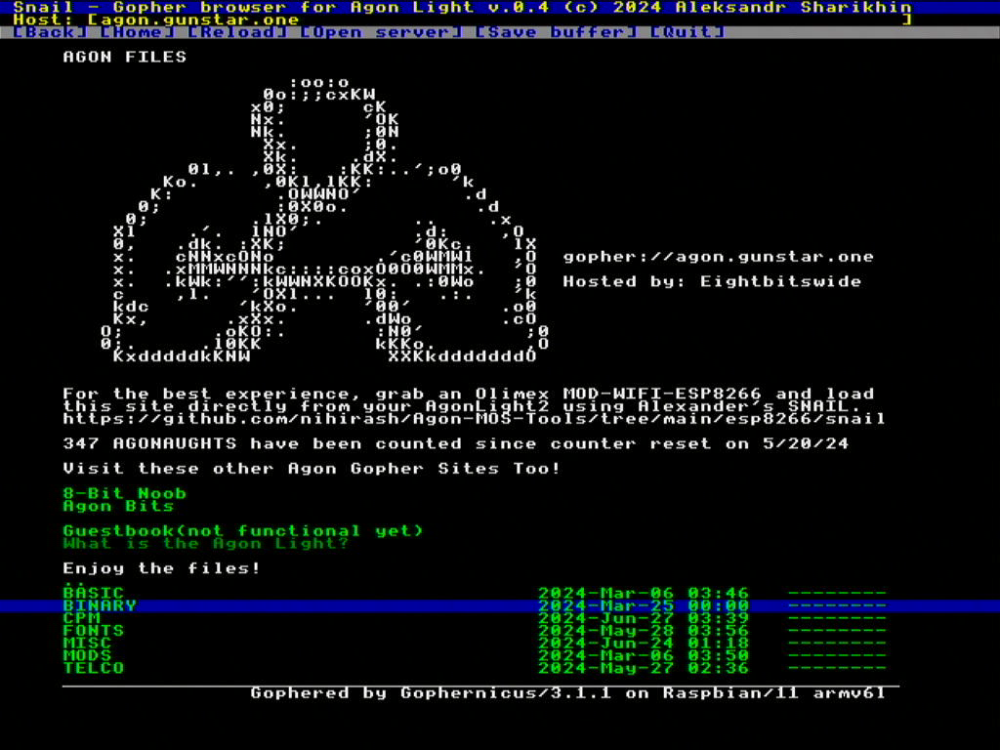

# Snail - fast gopher browser(and gophermap viewer) for Agon computers

## Requirements

 * Fresh Agon Console8 firmware on Agon Light or Agon Console 8

 * ESP8266 with Espressif AT firmware. Version should be 1.7.5.0 or later(see updating topic). I'm using [this module](https://www.olimex.com/Products/IoT/ESP8266/MOD-WIFI-ESP8266/open-source-hardware). It can be updated OTA without any issues and you don't need any soldering/using programmers to get your Agon online.

## Usage

Put browser to `/bin` directory of SD card.

Usual use case - just call `snail` as command and it will be loaded with home page or call it with URL as argument - `snail nihirash.net/agon` - and snail will try load specified path as URL.

Also you can load gophermaps from Agon's SD card(and use Snail as simple hypertext viewer) - just add `file:/` prefix before file name, for example `snail file:/test.gph` will load `test.gph` from current directory or `snail file://path/to/file.gph` will load `file.gph` from `/path/to/` directory.

## Writing yourown gophermaps(for local or even network usage)

Gophermaps are just plaintext files(with CRLF line ending). 

Good description of line format is explained at [wikipedia](https://en.wikipedia.org/wiki/Gopher_(protocol)#Source_code_of_a_menu). But Snail allows you cut some edges - for example just text rows can be written even without path, domain and port part, keeping just data type and text value.

From another side Snail got minor extension - it allows specify text color(can be applied to the end of line). For setting current color use `\xx` sequence, where `xx` is hex. number of color.

Also you can include images on your resources(in `.AGI` format) - just make link to it as binary. If file have `.AGI` extension - it will be automatically processed as IMAGE and shown on screen(in 320x240 with 64 colors mode).

## Development

Code written compiled with [agon-ez80asm](https://github.com/envenomator/agon-ez80asm). I'm strongly recommend use latest version of ez80asm - cause it updates often and goes better and better every day.

## Licensing

Snail browser licensed with [Nihirash's Coffeware License](LICENSE). It isn't hard to respect it.

Happy hacking!

## Supporting project

Feel free support project by code, misspell fixes, sharing info about it or even via [Ko-Fi service](https://ko-fi.com/nihirash).

Stay save and never support war aggression! 